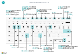

# Snabbguide för kortkommandon – endast dator

#### Allmänt

|Tryck på dessa tangenter|Om du vill|  
|-|-|
|Alt+F2|Visa och dölj rutan Faktabox|
|Alt+N|Skapa en ny post|
|Alt+Shift+N|Stäng en nyligen skapad post och skapa en ny|
|Alt+O|Lägg till en ny anteckning för den valda posten|
|Alt+Q|Öppna **Berätta**|
|Alt+Upp|Öppna knappbeskrivning eller valideringsfel|
|Alt+nedpil|Öppna en listruta eller ett uppslag|
|Alt+T|Öppna sidan **Mina inställningar**.|
|Alt+Shift+W|Öppna aktuellt kort eller dokument i ett nytt fönster|
|Ctrl+Ins|Infoga en ny rad i ett dokument|
|Ctrl-radera|Ta bort raden i ett dokument, en journal eller ett förslag|
|Ctrl+Shift+F12|Maximera radartikeldelen på en dokumentsida|
|Ctrl+F1|Öppna hjälpen för sidan Navigera vid anpassning|
|Ctrl + klicka|Navigera vid anpassning|
|Shift+F12|Öppna rollutforskaren, en funktionsöversikt|
|F5/Ctrl+F5|Uppdatera/läs in sidan.|
|Tabb/Shift+Tabb|Flytta fokus till nästa/föregående element|
|F6/Shift+F6|Flytta till nästa snabbflik/del|

#### Navigera och markera rader

|Tryck på dessa tangenter|Om du vill|
|-|-|
|Home/End|Gå till första/sista fältet|
|Ctrl+Home/End |Gå till första/sista raden|
|Ctrl+Upp/ned|Navigera utan att förlora markeringar|
|Ctrl+A |Markera allt|
|Ctrl+Blanksteg|Växla radmarkering|
|Ctrl/Shift+Klick|Lägg till rad/rader i markeringen|
|Shift+Upp/ned|Lägga till rad ovanför/nedanför markering|
|Shift+Page Up/Down|Markera synliga rader ovanför/nedanför|
|Ctrl+Enter|Fokusera ut från listan|

#### Kopiera och klistra in

|Tryck på dessa tangenter|Om du vill|
|-|-|
|Ctrl+C/V|Kopiera/klistra in rader|
|F8|Kopiera fält ovan till aktuell rad|

#### Sök, filtrera och sortera

|Tryck på dessa tangenter|Om du vill|
|-|-|
|Alt+F7|Sortera kolumn i stigande eller fallande ordning.|
|F3|Växla sökning|
|Shift+F3|Växla filterrutan; fokusera på fältfilter|
|Alt+F3|Filtrera efter markerade cellvärdet|
|Shift+Alt+F3|Lägg till filter i markerat fält fält|
|Ctrl+Alt+Shift+F3|Återställ filter|

#### Snabbinmatning

|Tryck på dessa tangenter|Om du vill|
|-|-|
|Ctrl+Shift+Enter|Gå till nästa snabbinmatningsfält utanför en lista|
|Enter/Shift+Enter|Gå till nästa/föregående snabbinmatningsfält|
##### Förhandsgranskning av rapport

|Tryck på dessa tangenter|Om du vill|
|-|-|
|Ctrl+Home/End|Gå till första/sista sidan|

> [!TIP]
> Om du vill ha en grafisk utskriftsversion väljer du följande bild och hämtar PDF-filen.
>
> 

[!INCLUDE[footer-include](includes/footer-banner.md)]