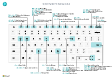

# Kortkommandon

Den här artikeln innehåller en översikt över några av de kombinationer av kortkommandon som du kan använda när du arbetar med [!INCLUDE[prod_short](includes/prod_short.md)].

En översikt över de vanligaste kortkommandona finns i [Kortkommandon (endast dator)](keyboard-shortcuts-cheatsheet.md).

> [!TIP]
> Om du vill visa en grafisk vy över de mest använda kortkommandona väljer du följande bild och hämtar PDF-filen.  
> 

## Översikt

Kortkommandona förbättrar tillgängligheten och kan göra det enklare och mer effektivt att navigera till olika områden och element på en sida. De stöds av de flesta webbläsare, beteendet kan dock variera något.

> [!NOTE]
> Kortkommandona som beskrivs här gäller amerikansk tangentbordslayout. Tangentlayouten på andra tangentbord kanske inte exakt motsvarar tangenterna på ett amerikanskt tangentbord.

De flesta kortkommandona är desamma oavsett om operativ systemet är Windows eller macOS. Vissa kortkommandon är emellertid olika för macOS. Dessa genvägar anges med hakparenteser i följande avsnitt.

> [!NOTE]
> Förutom de globala kortkommandon som beskrivs i denna artikel finns ett antal företagsspecifika genvägar. Till exempel i den generiska versionen av [!INCLUDE[prod_short](includes/prod_short.md)], bokför <kbd>F9</kbd> ett dokument och <kbd>Ctrl</kbd>+<kbd>F7</kbd> visar redovisningstransaktionerna för en post när du öppnar posten i ett kort. I denna artikel beskrivs några av de vanligaste företagsspecifika kortkommandona, som visas med kursiv stil. Tänk på att de faktiska kortkommandona kan variera i just din lösning. I användargränssnittet visas kortkommandot i knappbeskrivningen för den aktuella åtgärden.

## Allmänna kortkommandon

I tabellen nedan beskrivs kortkommandon för navigering och åtkomst av olika element på en sida. Element är t. ex. åtgärder, list rutor, uppslag m.m. Mer information om kortkommandon för att hantera poster när de visas i en lista finns i nästa avsnitt.

|Välj dessa tangenter (i macOS)|Om du vill|
|--------------------------------|----------|
|<kbd>Alt</kbd>|Visa snabbtangenter för att markera åtgärder i åtgärdsfältet och på navigeringsmenyn på sidan. Mer information finns i [snabbtangenter](#access-keys-for-action-bar-and-navigation-menu).|
|<kbd>Alt</kbd>+<kbd>Uppil</kbd>|Öppna en listruta eller leta upp ett värde för ett fält.|
|<kbd>Alt</kbd>+<kbd>Uppil</kbd>|Visa knappbeskrivning för ett fält eller en kolumnrubrik i en tabell. Om det finns valideringsfel för fältet, välj <kbd>Alt</kbd>+<kbd>Uppil</kbd> för att visa valideringsfelet. Välj <kbd>Esc</kbd> eller <kbd>Alt</kbd>+<kbd>Uppil</kbd> för att stänga knappbeskrivningen.|
|<kbd>F2</kbd>|Växla för att växla mellan att markera hela fältets värde eller att placera markören på slutet av fältets värde.|
|<kbd>Alt</kbd>+<kbd>F2</kbd>|Visa och dölj rutan Faktabox|
|<kbd>Alt</kbd>+<kbd>Shift</kbd>+<kbd>F2</kbd>|<kbd>Shift</kbd> mellan **Detaljer** och **Bifogade filer** i rutan faktabox.|
|<kbd>Alt</kbd>+<kbd>O</kbd>|Lägg till en ny anteckning för den valda posten även om rutan faktabox inte är öppen.|
|<kbd>Alt</kbd>+<kbd>Q</kbd>  (<kbd>Ctrl</kbd>+<kbd>alternativ</kbd>+<kbd>Q</kbd>)|Öppna fönstret **Berätta**. Mer information finns i [söka efter sidor och information med berätta](ui-search.md).|
|<kbd>Ctrl</kbd>+<kbd>Alt</kbd>+<kbd>Q</kbd>  (<kbd>Ctrl</kbd>+<kbd>alternativ</kbd>+<kbd>Cmd</kbd>+<kbd>Q</kbd>)|Öppna sidan **Sök poster** för att söka efter dokument och transaktioner som är relaterade till varandra baserat på gemensam information, som verifikationsnummer eller bokföringsdatum. Mer information finns i [söka efter relaterade fullständiga filer för bokförda dokument](ui-find-entries.md)|
|<kbd>Alt</kbd>+<kbd>N</kbd> |Öppna en sida om du vill skapa en ny post. (Påminner om att välja **Ny** och **+** åtgärder.)|
|<kbd>Alt</kbd>+<kbd>Shift</kbd>+<kbd>N</kbd> |Stäng en nyligen skapad sida och öppna en ny för att skapa en ny post. På samma sätt bokför <kbd>Alt</kbd>+<kbd>F9</kbd> ett dokument och skapar ett nytt.|
|<kbd>Alt</kbd>+<kbd>T</kbd>|Öppna sidan **Mina inställningar**.|
|<kbd>Alt</kbd>+<kbd>Högerpil</kbd>|Slå upp ytterligare information eller underliggande värden för ett fält som innehåller knappen . knappen. Detta används när den vanliga listruteknappen (<kbd>Alt</kbd>+<kbd>Uppil</kbd>) i samma fält används för ett annat syfte.|
|<kbd>Ctrl</kbd>+<kbd>Alt</kbd>+<kbd>Shift</kbd>+<kbd>C</kbd>|Visa information på företagsbrickan. Med början i Business Central 2022, utgivningscykel 2 (version 21) stöds inte längre denna genväg och ersattes av <kbd>Ctrl</kbd>+<kbd>O</kbd>. |
|<kbd>Ctrl</kbd>+<kbd>Alt</kbd>+<kbd>F1</kbd>|Öppna och stäng sidinspektionsrutan. Sidinspektionsrutan visar information om sidan, t. ex. dess källtabell, fält, filter, tillägg och annat.  Mer information finns i [Inspektionssidor](across-inspect-page.md).|
|<kbd>Ctrl</kbd>+<kbd>C</kbd> |Kopiera värdet i fältet. Om fältet är i fokus och du inte har valt någon text i fältet, kommer hela värdet att kopieras. Om du har markerat en text i fältet, kopieras endast den markerade texten.|
|<kbd>Ctrl</kbd>+<kbd>F1</kbd>|Öppna [hjälpfönstret](product-help-and-support.md#help-pane) eller en Business Central-hjälpartikel på [Microsoft Learn](/dynamics365/business-central/), beroende på din Business Central-version.|
|<kbd>Ctrl</kbd>+<kbd>F12</kbd>|Växla mellan breda och smala vyn.|
|<kbd>Ctrl</kbd>+Click|Navigera under anpassa personligt eller anpassa när åtgärden markeras med en pilspets. Mer information finns i [Anpassa din arbetsyta](ui-personalization-user.md).|  
|<kbd>Ctrl</kbd>+<kbd>F5</kbd>|Läs [!INCLUDE[prod_short](includes/prod_short.md)]-programmet på nytt. (Ungefär som att markera uppdatera/läsa in på nytt i webbläsaren).|
|<kbd>F5</kbd>|Uppdatera informationen på den aktuella sidan.  Använd denna nyckel för att se till att informationen på sidan har uppdaterats med ändringarna som andra har gjort medan du arbetar.|
|<kbd>Ctrl</kbd>+<kbd>O</kbd>|Öppna rutan **Tillgängliga företag** för att växla till ett annat företag eller en annan miljö. Mer information finns i [byta till ett annat företag eller annan miljö](ui-organization-switch.md).|
|<kbd>Enter</kbd>|Aktivera eller nå elementet eller kontrollen som är i fokus.|
|<kbd>Esc</kbd>|Stäng den aktuella sidan eller listrutan.|
|<kbd>Tabb</kbd>|Flytta fokus till nästa kontroll eller element på en sida, till exempel åtgärder, knappar, fält eller listrubriker.|
|<kbd>Shift</kbd>+<kbd>Tabb</kbd>|Flytta fokus till föregående kontroll eller element på en sida, till exempel åtgärder, knappar, fält eller listrubriker.|
|<kbd>Y</kbd> och <kbd>N</kbd>|Aktivera knapparna **Ja** och **Nej** i dialogrutor. De faktiska nycklarna kan variera beroende på vilket språk som anges i **Mina inställningar**. Du kan t.ex. välja <kbd>J</kbd> för att aktivera knappen **Ja** när du använder tyska språket.|

## Kortkommandon i listor

I följande tabell beskrivs de kortkommandon som du kan använda i en listsida. Genvägsåtgärden skiljer sig något beroende på om sidan visas som listvy eller sida vid sida.
<!--
> [!Note]
> In the table that follows, the term *actionable field* refers to a field on which you can do something, like change a value or link to another page. In general, the shortcuts will skip over fields that display information that you cannot change from the list (in other words, fields that are read-only).
-->
### Allmänt

|Välj dessa tangenter (i macOS)|För att göra detta som en lista|För att göra detta som en panelvisning |
|--------------------------------|-------------------------|--------------------------|
|<kbd>Alt</kbd>+<kbd>F7</kbd> |Sortera markerad kolumn i stigande eller fallande ordning.|Ej tillämpbart.|
|<kbd>Alt</kbd>+<kbd>N</kbd>|Infoga en ny rad i en redigerbar lista, till exempel sidan **redovisningsbudgetar**.|Samma.|
|<kbd>Shift</kbd>+<kbd>F9</kbd>|Bokför och skriv ut ett dokument.|Samma.|
|<kbd>Shift</kbd>+<kbd>F10</kbd> |Öppna en meny med alternativ som är tillgängliga för den markerade raden.|Samma.|
|<kbd>Alt</kbd>+<kbd>D</kbd>|Öppna posterna för dimensionsuppsättning.|Samma.|
|<kbd>Ctrl</kbd>+<kbd>F7</kbd>|Öppna redovisningstransaktioner, loggtransaktioner, kostnadstransaktioner o.s.v.|
|<kbd>Ctrl</kbd>+<kbd>F9</kbd>|Frisläpp dokument.|Samma.|
|*<kbd>F7</kbd>*|Öppna statistik.|Samma.|
|*<kbd>F9</kbd>*|Bokföra, utfärda, registrera eller återföra dokument.|Samma.|
|*<kbd>Shift</kbd>+<kbd>Ctrl</kbd>+<kbd>F</kbd>*|Skicka förslag på rader på sidan för kalkylark för kassaflöde.|Ej tillämpbart.|
|*<kbd>Shift</kbd>+<kbd>Ctrl</kbd>+<kbd>I</kbd>*|Visa serie- och partinummer som har tilldelats till radartikeln för dokument eller journal.|Ej tillämpbart.|

### Navigera mellan rader och kolumner

Det finns stödraster som innehåller rader och kolumner på många olika sidtyper i [!INCLUDE[prod_short](includes/prod_short.md)], till exempel listsidor och **Rad**-delar i dokument. Att flytta från en cell till en annan i ett rutnät kan ske helt och hållet via tangentbordet.

| Välj dessa tangenter (i macOS) | För att göra detta som en lista | För att göra detta som en panelvisning |
|--|--|--|
| <kbd>Ctrl</kbd>+<kbd>Home</kbd>  (<kbd>Fn</kbd>+<kbd>Ctrl</kbd>+<kbd>Vänsterpil</kbd>) | Markera den första raden i listan. Fokus är kvar i samma kolumn. | Flytta till första panelen i den första raden. |
| <kbd>Ctrl</kbd>+<kbd>End</kbd>  (<kbd>Fn</kbd>+<kbd>Ctrl</kbd>+<kbd>Högerpil</kbd>) | Markera den sista raden i listan. Fokus är kvar i samma kolumn. | Flytta till den sista panelen i den sista raden. |
| <kbd>Hem</kbd>  (<kbd>Fn</kbd>+<kbd>vänsterpil</kbd>) | Flytta till första fältet i raden. | Flytta till första panelen i raden. |
| <kbd>End</kbd>  (<kbd>Fn</kbd>+<kbd>högerpil</kbd>) | Flytta till det sista fältet i raden. | Flytta till den sista panelen i raden. |
| <kbd>Skriv in</kbd> | Öppna posten som är associerad med fältet.  Endast relevant om en sida med kort associerad med posten. | Posten öppnas.  Endast relevant om en sida med kort associerad med posten. |
| <kbd>Ctrl</kbd>+<kbd>Enter</kbd> | Flytta fokus till nästa element utanför listan. | Flytta fokus till nästa element utanför listan. |
| <kbd>Page Up</kbd>  (<kbd>Fn</kbd>+<kbd>uppåtpil</kbd>) | Rulla för att visa uppsättningen med rader ovanför den aktuella raden i vyn. | Rullar för att visa uppsättningen med paneler ovanför den aktuella panelen i vyn. |
| <kbd>Page Down</kbd>  (<kbd>Fn</kbd>+<kbd>uppåtpil</kbd>) | Rulla för att visa uppsättningen med rader nedanför den aktuella raden i vyn. | Rulla för att visa uppsättningen med paneler nedanför den aktuella panelen i vyn. |
| <kbd>Uppil</kbd> | Flytta till fältet i raden nedanför i samma kolumn. | I samma kolumn, flytta till panelen i raden nedanför. |
| <kbd>Uppil</kbd> | Flytta till fältet i raden ovanför i samma kolumn | I samma kolumn, flytta till panelen i raden ovanför |
| <kbd>Högerpil</kbd> | I en skrivskyddad lista, flytta till samma rad till höger i samma fält.  Flytta till höger i det aktuella fältet i en redigeringsbar lista. | Flytta till nästa ändringsbara panel till höger i samma rad. |
| <kbd>Vänsterpil</kbd> | I en skrivskyddad lista, flytta till samma rad till vänster i föregående fält.   Flytta till vänster i det aktuella fältet i en redigeringsbar lista. | Flytta till föregående panel till vänster i samma rad. |
| <kbd>Tabb</kbd> | I en redigerbar lista, flytta till samma rad till höger i samma fält. | Ej tillämpbart. | 
| <kbd>Shift</kbd>+<kbd>Tabb</kbd> | I en redigerbar lista, flytta till samma rad till vänster i föregående fält. | Ej tillämpbart. |

### Välja kopiera och klistra in

|Välj dessa tangenter (i macOS)|För att göra detta som en lista |För att göra detta som en panelvisning |
|--------------------------------|--------------------------|--------------------------|
|<kbd>Ctrl</kbd>+Click  (<kbd>Cmd</kbd>+klicka)|Utöka radmarkeringen så att den rad som du klickar på inkluderas.|Ej tillämpbart.|
|<kbd>Shift</kbd>+klicka|Utöka radmarkeringen så att den rad som du klickar på och samtliga där emellan inkluderas.  Du kan använda detta när du har använt <kbd>Ctrl</kbd>+<kbd>uppil</kbd> eller <kbd>Ctrl</kbd>+uppil/nedpil för att utöka ditt val.|Ej tillämpbart.|
|<kbd>Ctrl</kbd>+<kbd>Uppil</kbd>  (<kbd>Ctrl</kbd>+<kbd>Cmd</kbd>+<kbd>Uppil</kbd>)|Flytta fokus till raden ovanför och behåll den aktuella raden som har valts.|Ej tillämpbart.|
|<kbd>Ctrl</kbd>+<kbd>Uppil</kbd>  (<kbd>Ctrl</kbd>+<kbd>Cmd</kbd>+<kbd>Uppil</kbd>)|Flytta fokus till raden nedanför och behåll den aktuella raden som har valts.|Ej tillämpbart.|
|<kbd>Ctrl</kbd>+<kbd>Blanksteg</kbd>  (<kbd>Ctrl</kbd>+<kbd>Cmd</kbd>+blanksteg)|Utöka radmarkeringen så att den markerade raden inkluderas.  Du kan använda detta när du har använt <kbd>Ctrl</kbd>+<kbd>Uppil</kbd> eller <kbd>Ctrl</kbd>+<kbd>Uppil</kbd> för att utöka ditt val.|Ej tillämpbart.|
|<kbd>Ctrl</kbd>+<kbd>A</kbd>|Markera alla rader.|Ej tillämpbart.|
|<kbd>Ctrl</kbd>+<kbd>C</kbd>  (<kbd>Cmd</kbd>+<kbd>C</kbd>)|Kopiera de markerade raderna till Urklipp.|Ja, men endast för en enstaka markerad panel.|
|<kbd>Ctrl</kbd>+<kbd>V</kbd>  (<kbd>Cmd</kbd>+<kbd>V</kbd>)|Klistra in de markerade raderna från Urklipp till den aktuella sidan eller ett externt dokument såsom Microsoft Excel eller Outlook e-post. Du kan bara göra detta i redigerbara listor.|Ej tillämpbart.|
|<kbd>Shift</kbd>+<kbd>Uppil</kbd>|Utöka radmarkeringen så att raden ovan inkluderas.|Ej tillämpbart.|
|<kbd>Shift</kbd>+<kbd>Uppil</kbd>|Utöka radmarkeringen så att raden nedan inkluderas.|Ej tillämpbart.|
|<kbd>Shift</kbd>+<kbd>Page Up</kbd>  (<kbd>Shift</kbd>+<kbd>Fn</kbd>+<kbd>Uppil</kbd>)|Utöka radmarkeringen så att samtliga rader som visas ovanför den aktuella radmarkeringen inkluderas.|Ej tillämpbart.|
|<kbd>Shift</kbd>+<kbd>Page Down</kbd>  (<kbd>Shift</kbd>+<kbd>Fn</kbd>+<kbd>Uppil</kbd>)|Utöka radmarkeringen så att samtliga synliga rader nedanför den aktuella radmarkeringen inkluderas.|Ej tillämpbart.|
|<kbd>F8</kbd>|Kopiera fältet i samma kolumn i raden ovanför och klistra in den i den aktuella raden. Du kan bara göra detta i redigerbara listor. Med detta kortkommando följt av en <kbd>flik</kbd> kan du snabbt kan fylla i fält i radposter som du vill ska ha samma värde som raden ovan.|Ej tillämpbart.|

### Söka och filtrera listor

|Välj dessa tangenter (i macOS)|Om du vill|
|--------------------------------|----------|
|<kbd>F3</kbd>|Växlar sökrutan.<ul><li>Aktivera sökrutan så att du kan börja skriva söktexten.</li><li>Om sökrutan redan är aktiverad, återgår <kbd>F3</kbd> till listan utan att radera söktexten.</li><ul>|
|<kbd>Shift</kbd>+<kbd>F3</kbd>|Öppna och stäng filterrutan.<ul><li> Om filterrutan inte är öppen öppnar du <kbd>Shift</kbd>+<kbd>F3</kbd> och fokuserar på åtgärden **+ Filter** under **Filtrera lista efter**. Du kan sedan bara trycka på <kbd>retur</kbd> när du vill börja lägga till ett fältfilter.</li><li>Om filterrutan redan är öppen stängs den med <kbd>Shift</kbd>+<kbd>F3</kbd> men rensar inte alla filter som du har lagt till.</li></ul>|
|<kbd>Ctrl</kbd>+<kbd>Shift</kbd>+<kbd>F3</kbd>|Öppna och stäng filterrutan.<ul><li> Om filterrutan inte är öppen öppnar du <kbd>Ctrl</kbd>+<kbd>Shift</kbd>+<kbd>F3</kbd> occh fokuserar på åtgärden **+ Filter** under **Filtrera summa efter**. Du kan sedan bara trycka på <kbd>retur</kbd> när du vill börja lägga till ett summeringsfilter.</li><li>Om filterrutan redan är öppen stängs den med <kbd>Ctrl</kbd>+<kbd>Shift</kbd>+<kbd>F3</kbd> men rensar inte alla filter som du har lagt till.</li></ul>  |
|<kbd>Alt</kbd>+<kbd>F3</kbd>|Aktivera/inaktivera filtreringen till det valda värdet.<ul><li>Använder ett kolumnfilter på det markerade filtervärdet i listan. Detta är detsamma som att välja **filtrera på det här värdet** från en kolumnrubrik. Den öppnar filterrutan, ställer in filter till det valda värdet när fokus är på en cell i listan.</li><li>Om kolumnen redan är filtrerad rensar <kbd>Alt</kbd>+<kbd>F3</kbd> filtret på den kolumnen.</li></ul> |
|<kbd>Shift</kbd>+<kbd>Alt</kbd>+<kbd>F3</kbd>|Öppna filterfönstret och lägg till ett filter för den markerade kolumnen i listan. Fokus är på det nya filterfältet som börjar skriva filterkriterierna direkt.   Detta innebär att välja **Filter** från kolumnrubriken.  Om det redan finns ett filter i fältet, läggs ett nytt filter till. |
|<kbd>Ctrl</kbd>+<kbd>Shift</kbd>+<kbd>Alt</kbd>+<kbd>F3</kbd>|Återställ filter. Detta är detsamma som att välja **Återställ filter** i filterrutan och kopplar det till fält och totala filter.   Filter återgår till standardfilter för den aktuella vyn. Om den aktuella vyn är **alla** motsvarar detta att återvända till en ofiltrerad vy med alla poster. |
|<kbd>Ctrl</kbd>+<kbd>Enter</kbd>|Växla fokus från den filterrutan tillbaka till listan.|

## Kortkommandon i kort och dokument

Följande kortkommandon kan användas för kortsidorna t. ex. **kundkort** och dokumentsidor t. ex. **försäljningsorder** för att visa och ändra poster.

|Välj dessa tangenter (i macOS)|Om du vill|
|--------------------------------|----------|
|<kbd>Alt</kbd>+<kbd>D</kbd>|Öppna posterna för dimensionsuppsättning.|
|<kbd>Alt</kbd>+<kbd>F6</kbd>|Växla dölj/expandera för den aktuella <kbd>snabbfliken</kbd> eller delen (underordnad sida).|
|<kbd>Alt</kbd>+<kbd>F9</kbd>|Skapa ett nytt dokument och bokföra det.|
|<kbd>Alt</kbd>+<kbd>G</kbd>|Öppna sidan **Hitta transaktioner** för att söka efter transaktioner som hör till det bokförda dokumentet. Fungerar även på listor.|
|<kbd>Alt</kbd>+<kbd>N</kbd> |Öppna en sida för att skapa en ny post. På samma sätt som om du markerar åtgärden **nytt**. |
|<kbd>Alt</kbd>+<kbd>Shift</kbd>+<kbd>N</kbd> |Stäng en sida och öppna en ny för att skapa en ny post. På samma sätt som om du markerar åtgärden **OK och Nytt**. |
|<kbd>Alt</kbd>+<kbd>Shift</kbd>+<kbd>W</kbd> |Öppna aktuellt kort eller dokument i ett nytt fönster. Mer information finns i [multikörning på flera sidor.](ui-enter-data.md#multitasking-across-multiple-pages)|
|<kbd>Ctrl</kbd>+<kbd>Enter</kbd>|Spara och stäng sidan.|
|<kbd>Ctrl</kbd>+<kbd>Uppil</kbd>|Öppna nästa post för en enhet.|
|<kbd>Ctrl</kbd>+<kbd>Uppil</kbd> |Öppna föregående post för en enhet.|
|<kbd>Ctrl</kbd>+<kbd>Insert</kbd> |Infoga en ny rad i ett dokument|
|<kbd>Ctrl</kbd>+<kbd>Delete</kbd> |Ta bort raden i ett dokument, en journal eller ett förslag.|
|<kbd>Ctrl</kbd>+<kbd>F7</kbd>|Öppna redovisningstransaktioner, loggtransaktioner, kostnadstransaktioner o.s.v.|
|<kbd>Ctrl</kbd>+<kbd>F9</kbd>|Frisläpp dokument.|
|<kbd>Ctrl</kbd>+<kbd>Shift</kbd>+<kbd>F12</kbd> |Maximera radartikeldelen på en dokumentsida Välj knapparna igen för att återgå till normal visning. Mer information finns i [Fokusera på radartiklar](ui-enter-data.md#Focus).|
|<kbd>F6</kbd>|Flytta till nästa <kbd>snabbflik</kbd> eller del (underordnad sida).|
|*<kbd>F7</kbd>*|Öppna statistik.|
|*<kbd>F9</kbd>*|Bokföra, utfärda, registrera eller återföra dokument.|
|*<kbd>Shift</kbd>+<kbd>Ctrl</kbd>+<kbd>F9</kbd>*|Bokföra, skriva ut och föra in lagerinleverans.|
|<kbd>Shift</kbd>+<kbd>F6</kbd>|Flytta till föregående <kbd>snabbflik</kbd> eller del (underordnad sida).|
|*<kbd>Shift</kbd>+<kbd>F9</kbd>*|Bokför och skriv ut ett dokument.|

## Kortkommandon för snabbinmatning för fält

Följande kortkommandon gäller funktionen snabbinmatning på kort, dokument och listsidor. På listor kan inte genvägar användas när listan är i panelvyn. Mer information om snabbinmatnings finns i [påskynda datainmatning med snabbinmatning](ui-enter-data.md#QuickEntry).

|Välj dessa tangenter (i macOS)|Om du vill|Anmärkningar|
|--------------------------------|----------|-------|
|<kbd>Skriv in</kbd>|Bekräfta värdet i nuvarande fält och gå till nästa snabbinmatningsfält.||
|<kbd>Shift</kbd>+<kbd>Enter</kbd>|Bekräfta värdet i nuvarande fält och gå till föregående snabbinmatningsfält.||
|<kbd>Ctrl</kbd>+<kbd>Shift</kbd>+<kbd>Enter</kbd>|Bekräfta värdet i nuvarande kolumn och gå till nästa snabbinmatningsfält utanför listan.  Detta kortkommando gäller för inbäddade listor på en sida, till exempel radartiklar på en försäljningsorder. På så sätt kan du snabbt komma ut ur listan och fortsätta skriva in data i övriga fält på sidan.|

## Kortkommandon i kalendern (datumväljare)

När ett datumfält konfigureras kan du ange datumet manuellt eller öppna en kalender (datumväljare) där du kan välja önskat datum. I följande tabell beskrivs kortkommandon för kalendern.

|Välj dessa tangenter (i macOS)|Om du vill|
|--------------------------------|----------|
|<kbd>Ctrl</kbd>+<kbd>Home</kbd>|Öppna kalendern om stängd. **Obs**! Detta fungerar inte om datumfältet är i ett rutnät, där <kbd>Ctrl</kbd>+<kbd>Home</kbd> går till den första raden.|
|<kbd>Ctrl</kbd>+<kbd>Home</kbd>  (<kbd>Cmd</kbd>+<kbd>Home</kbd>)|Flytta till aktuell månad, aktuell dag.|
|<kbd>Ctrl</kbd>+<kbd>Vänsterpil</kbd>  (<kbd>Cmd</kbd>+<kbd>Vänsterpil</kbd>)|Flytta till föregående dag.|
|<kbd>Ctrl</kbd>+<kbd>Högerpil</kbd>  (<kbd>Cmd</kbd>+<kbd>Högerpil</kbd>)|Flytta till nästa dag|
|<kbd>Ctrl</kbd>+<kbd>Uppil</kbd>  (<kbd>Cmd</kbd>+<kbd>uppil</kbd>)|Flytta till föregående vecka, samma dag i veckan.|
|<kbd>Ctrl</kbd>+<kbd>Uppil</kbd>  (<kbd>Cmd</kbd>+<kbd>uppil</kbd>)|Flytta till nästa vecka, samma dag i veckan.|
|<kbd>Skriv in</kbd>|Välj fokuserat datum.|
|<kbd>Ctrl</kbd>+<kbd>End</kbd>  (<kbd>Cmd</kbd>+<kbd>End</kbd>)|Stäng kalendern och ta bort aktuellt datum.|
|<kbd>Esc</kbd>|Stäng kalendern utan markering, och behåll aktuellt datum.|
|<kbd>Page Down</kbd>|Flytta till nästa månad|
|<kbd>Page Up</kbd>|Flytta till föregående månad|  

## Kortkommandon i datumfält

|Välj dessa tangenter (i macOS)|Om du vill|
|--------------------------------|----------|
|<kbd>d</kbd>|Ange aktuellt datum. "I" betyder "i dag".|
|<kbd>a</kbd>|Ange arbetsdatum. Mer information finns i [Arbetsdatum](ui-change-basic-settings.md#work-date)|

## Kortkommandon i Förhandsgranska rapport

|Välj dessa tangenter (i macOS)|Om du vill|
|--------------------------------|----------|
|<kbd>Uppil</kbd>|Rulla nedåt på sidan.|  
|<kbd>Uppil</kbd>|Rulla uppåt på sidan.|
|<kbd>Ctrl</kbd>+<kbd>0</kbd> (noll)  (<kbd>Cmd</kbd>+<kbd>0</kbd>)|Passar in hela sidan på sidan. |
|<kbd>Ctrl</kbd>+<kbd>Home</kbd>  (<kbd>Cmd</kbd>+<kbd>Home</kbd>)|Gå till den första sidan i rapporten.|
|<kbd>Ctrl</kbd>+<kbd>End</kbd>  (<kbd>Cmd</kbd>+<kbd>Home</kbd>)|Gå till den sista sidan i rapporten.|
|<kbd><kbd>Vänsterpil</kbd></kbd>|Rulla åt vänster när sidan zoomas in så att den inte visas helt och hållet. |
|<kbd>Högerpil</kbd>|Rulla åt höger när sidan zoomas in så att den inte visas helt och hållet. |
|<kbd>Page Down</kbd>  (<kbd>Fn</kbd>+<kbd>uppåtpil</kbd>)|Gå till nästa sida i rapporten.|
|<kbd>Page Up</kbd>  (<kbd>Fn</kbd>+<kbd>uppåtpil</kbd>)|Gå till föregående sida i rapporten.|

## Kortkommandon för zoomning in och ut

|Välj dessa tangenter|Om du vill|
|--------------------------------|----------|
|<kbd>Ctrl</kbd>+<kbd>+</kbd>|Zooma in den aktuella sidan.|  
|<kbd>Ctrl</kbd>+<kbd>-</kbd>|Zooma ut på den aktuella sidan.|  
|<kbd>Ctrl</kbd>+<kbd>0</kbd>|Zooma in eller ut till 100 % på den aktuella sidan.|  

## Kortkommandon för rollutforskaren

Rollutforskaren ger dig en översikt över och snabb åtkomst till alla affärsfunktioner som är tillgängliga för din roll. Mer information finns i [Söka efter sidor med rollutforskaren](ui-role-explorer.md).

|Välj dessa tangenter (i macOS)|Om du vill|
|--------------------------------|----------|
|<kbd>Shift</kbd>+<kbd>F12</kbd>|Öppna rollutforskaren.|
|<kbd>F3</kbd>|Öppna rutan **Sök** i rollutforskaren om du vill hitta funktioner baserade på ett visst sökord eller en viss term.|
|<kbd>F3</kbd> eller <kbd>Ctrl</kbd>+<kbd>Uppil</kbd>|Flyttar fokus till nästa funna funktion i rollutforskaren. <kbd>F3</kbd> flyttar fokus till rutan **Sök** efter den senast funna funktionen.|
|<kbd>Shift</kbd> <kbd>F3</kbd> eller <kbd>Ctrl</kbd>+<kbd>Uppil</kbd>|Flytta fokus till föregående funna funktion i rollutforskaren.|
|<kbd>Ctrl</kbd>+<kbd>Shift</kbd>|Visa eller dölj alla undernoder – utöver noder på översta nivån – när du väljer åtgärden **Visa** eller **Dölj**.|

## Kortkommandon för numeriskt tangentbord

I följande tabell beskriver kortkommandon på en numerisk knappsats.

|Välj dessa tangenter (i macOS)|Om du vill|
|--------------------------------|----------|
|<kbd>Alt</kbd>+<kbd>Decimalavgränsare</kbd>|Ändra resultatet av decimal tecknet till antingen en punkt (.) eller det tecken som bestäms av inställningen **region** på sidan **mina inställningar**. För mer information, se [Ange decimalavgränsare som används av numeriska tangentbord](ui-enter-data.md#decimal).|

## Snabbtangenter för åtgärdsfält och navigeringsmeny

Snabbtangenter är kortkommandon som markerar specifika åtgärder på åtgärdsfältet och på navigeringsmenyn, så att du kan navigera i instruktioner för att komma till den sida du vill ha. Snabbtangenter är tillgängliga i Business Central webbklient och liknar snabbtangenter i Excel och Word Online.  

Om du vill använda snabbtangenter på en sida väljer du <kbd>Alt</kbd>-tangenten för att visa *tangentbeskrivningar*, som är bokstäver i små rutor bredvid åtgärderna i åtgärdsfältet och på menynnavigering. 

 

Välj en åtgärd genom att välja den tangentkombination som visas i tangentbeskrivningar, t.ex. <kbd>H</kbd> eller <kbd>J</kbd>+<kbd>F</kbd>.
- Om åtgärden öppnas på en undermeny med andra åtgärder, visas tangentbeskrivningar för undermenyn så att du kan fortsätta använda snabbtangenter om du vill.
- Om åtgärden öppnar en annan sida inaktiveras tangentbeskrivningar. För att visa dem igen väljer du <kbd>Alt</kbd>-tangenten. 
 
## Se även

[Snabbguide för kortkommandon – endast dator](keyboard-shortcuts-cheatsheet.md)  
[Hjälpmedelsfunktioner](ui-accessibility.md)  
[Gör dig redo att göra affärer](ui-get-ready-business.md)  
[Arbeta med [!INCLUDE[prod_short](includes/prod_short.md)]](ui-work-product.md)  
[Vanliga frågor och svar](across-faq.yml)  
[Hitta transaktioner](ui-find-entries.md)  

[!INCLUDE[footer-include](includes/footer-banner.md)]
