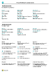

# Arbeta med [!INCLUDE[d365fin](includes/d365fin_md.md)]
När du utför verksamhetsuppgifter samverkar du med data på olika sätt, till exempel skapar poster och registrerar data, sorterar och filtrerar data, skriver noteringar och skickar data till andra program.

Du kan t.ex. justera storleken och positionen på alla sidor, utöka bredden på kolumner och öka höjden kolumnrubriker, samt ändra sorteringen av data i kolumner. Och om du vill använda den vågräta rullningslisten för att visa alla kolumner på en listsida eller dokumentrader, kommer du att se att det finns en lodrät låsning så att en del kolumner inte rullas.

> [!TIP]
> Om du vill visa en utskriftsvänlig översikt över de mest använda funktionerna väljer du följande bild och hämtar PDF-filen.
>
> 

> [!NOTE]
> Förutom de allmänna användargränssnittsfunktionerna som beskrivs i det här avsnittet kan du använda andra allmänna funktioner som är mer affärsrelaterade. Mer information finns i [Allmänna affärsfunktioner](ui-across-business-areas.md).

I tabellen nedan anges några av de grundläggande funktioner med länkar till avsnitten där de beskrivs.

| Till | Gå till |
| --- | --- |
|Söka efter en viss sida, rapport, åtgärd, hjälpavsnitt eller partnertillägget. |[Söka efter sidor och information med berätta](ui-search.md) |
|Få en översikt över sidorna för din roll och för andra roller och navigera till sidor.|[Söka efter sidor med rollutforskaren](ui-role-explorer.md)|
| Filtrera data i vyer, rapporter eller funktioner genom att använda speciella symboler och tecken. |[Sortera, söka och filtrera listor](ui-enter-criteria-filters.md) |
|Lär dig om många allmänna funktioner som gör det snabbt och enkelt att registrera data.|[Ange data](ui-enter-data.md)|
|Lär dig hur du snabbt kopierar och klistrar in data bland annat med hjälp av kortkommandon.|[Vanliga frågor om Kopiera och klistra in](ui-copy-paste.md)|
| Visa eller bearbeta data i specifika datumintervall. |[Arbeta med kalenderdatum och tider](ui-enter-date-ranges.md) |
| Se vilka fält som måste fyllas i. |[Identifiera obligatoriska fält](ui-mandatory-fields.md) |
|Förstå hur datorns språkversion påverkar användargränssnittet och hjälpwebbplatsen samt hur du ändrar språk.|[Byta språk och plats](about-locale-language.md)|
|Lär dig hur du använder Excel från nästan var som helst i [!INCLUDE[d365fin](includes/d365fin_md.md)]|[Visa och redigera i Excel](across-work-with-excel.md)|
|Bifoga filer, lägga till länkar eller skriva anteckningar på kort och dokument.|[Hantera bifogade filer, länkar och anteckningar på kort och dokument](ui-how-add-link-to-record.md)|
| Ändra grundläggande inställningar som företag, arbetsdatum eller rollcenter. |[Ändra grundinställningar](ui-change-basic-settings.md) |
|Få meddelanden om vissa händelser eller ändringar av status, till exempel när du ska fakturera kunden har en förfallen skuld.|[Hantera meddelanden](ui-smart-notifications.md)|
| Ändra vilken och var användargränssnittelement visas för att passa dina behov.|[Anpassa din arbetsyta](ui-personalization-user.md) |
|Definiera, förhandsgranska, skriva ut, eller spara rapporter och definiera och kör batch-jobben.|[Arbeta med rapporter och batch-jobb och XMLports](ui-work-report.md)|
| Administrera innehåll och format i rapporter och dokument, inklusive vilka datafält i en rapportdatauppsättning som visas i rapporten och hur dessa ordnas, textstil, bilder och mycket annat.|[Hantera rapport- och dokumentlayouter](ui-manage-report-layouts.md) |
|Lär dig mer om funktioner och möjligheter som gör [!INCLUDE[d365fin](includes/d365fin_md.md)] lättillgängligt för användare med funktionshinder.|[Hjälpmedel och kortkommandon](ui-accessibility.md)|

## Hitta rätt i Business Central
Här följer en kort video om hur du navigerar i [!INCLUDE[d365fin](includes/d365fin_md.md)].

> [!VIDEO https://www.youtube.com/embed/zqz03iMihx0]

## Se även
[Komma igång](product-get-started.md)  
[Ställa in Business Central](setup.md)  
[Allmänna affärsfunktioner](ui-across-business-areas.md)  

## [!INCLUDE[d365fin](includes/free_trial_md.md)]  
## [!INCLUDE[d365fin](includes/training_link_md.md)]
